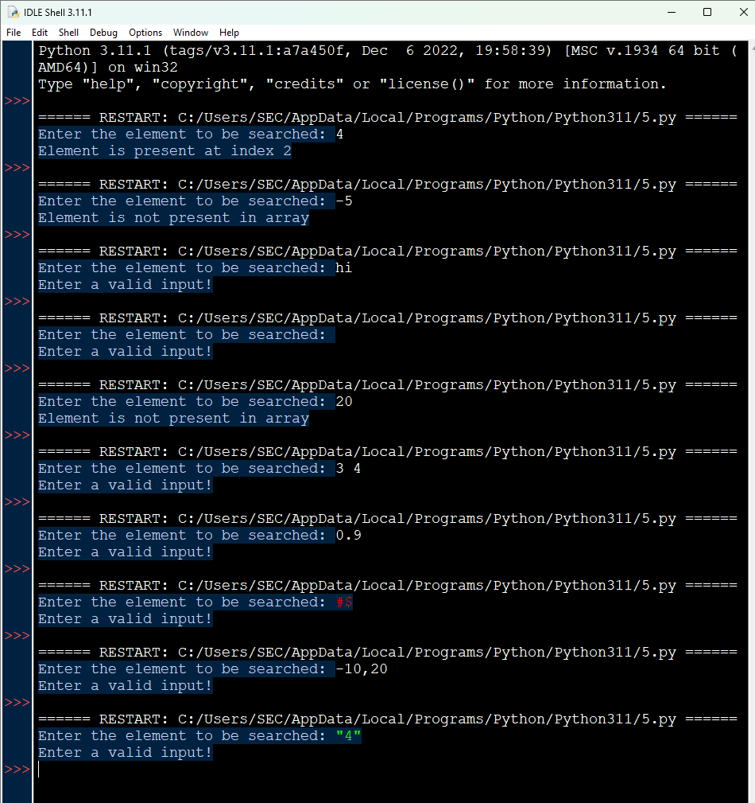

# Ex.No: 5 check the given number is present in array or not and inspect for failures.
### DATE: 27/09/2024
### REGISTER NUMBER : 212222040109
### AIM: 
Write a python program for Binary Search and inspect for failures.

### Algorithm:

1. Start the program.
2. Get the list from the user
3. Get the element to be searched
4. Compare the mid element with the key, if same return the index
5. If key is greater, search it in the right side, else search it in the left side.
6. If not found return -1
7. Stop the program.
### Program:

```
def binary_search(arr, x):
    low = 0
    high = len(arr) - 1
    mid = 0
    while low <= high:
        mid = (high + low) // 2
        if arr[mid] < x:
            low = mid + 1
        elif arr[mid] > x: 
            high = mid - 1 
        else:
            return mid
    return -1 
arr =[2,3,4,10,40] 
x = input("Enter the element to be searched: ")
try: 
    x = int(x) 
    result = binary_search(arr, x) 
    if result != -1: 
        print("Element is present at index",str(result)) 
    else: 
        print("Element is not present in array") 
except: 
    print("Enter a valid input!")
```


### Output:



### Result:
Thus, the python program to check the number is Armstrong number or not implemented and the output is verified successfully.

